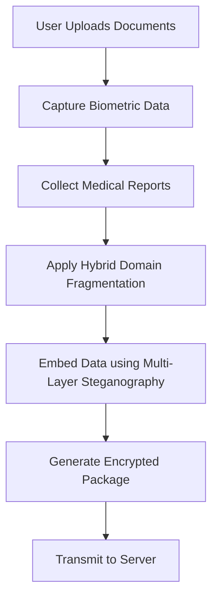
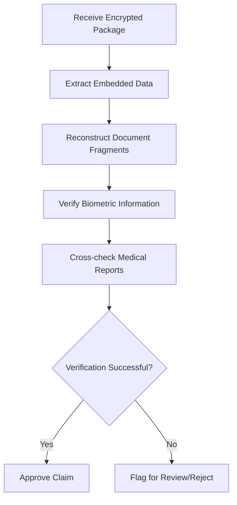

# 🔐 Secure Online Insurance Claim Verification System

**Study and Implementation of secure online insurance claim documents verification by multi-layer authentication using biometric information**

[](https://bppimt.in)
[]()
[]()

---

## 📋 Table of Contents

- [Overview](#overview)
- [Objectives](#objectives)
- [Key Features](#key-features)
- [System Architecture](#system-architecture)
- [Technologies & Algorithms](#technologies--algorithms)
- [Workflow](#workflow)
- [Performance Metrics](#performance-metrics)
- [Results](#results)
- [Future Directions](#future-directions)
- [Team](#team)
- [References](#references)

---

## 🎯 Overview

This project presents a **secure multi-layer authentication system** for online insurance claim verification that combines biometric data, medical reports, and insurance documents to prevent fraud and ensure tamper-proof verification.

The system employs cutting-edge techniques including:
- **Hybrid domain-based image fragmentation** for document protection
- **Multi-layer steganography** to embed biometric and medical information
- **Server-side reconstruction and verification** for secure end-to-end processing

---

## 🎯 Objectives

- ✅ Ensure secure, tamper-proof, multi-layered verification of insurance claim documents
- 🛡️ Prevent fraud using biometric authentication
- 🔍 Detect mismatches in user-provided documents
- 🔒 Safely and invisibly embed sensitive information inside insurance documents
- 🌐 Provide secure end-to-end verification via server

---

## ⚡ Key Features

| Feature | Description |
|---------|-------------|
| **Multi-layer Security Model** | Combines multiple authentication layers for enhanced protection |
| **DCT Fragmentation** | Prevents tampering through frequency-based image splitting |
| **Stego-based Biometric Embedding** | Invisibly embeds biometric data within documents |
| **Automated Verification Pipeline** | Fully automated end-to-end claim processing |
| **Forgery Detection** | Advanced tamper detection capabilities |

---

## 🏗️ System Architecture

### Core Components

```
┌─────────────────┐         ┌─────────────────┐         ┌─────────────────┐
│   Client Side   │────────>│  Transmission   │────────>│   Server Side   │
│                 │         │                 │         │                 │
│ • Biometric     │         │ • Encrypted     │         │ • Verification  │
│ • Medical Data  │         │   Channel       │         │ • Reconstruction│
│ • Document      │         │                 │         │ • Authentication│
└─────────────────┘         └─────────────────┘         └─────────────────┘
```

### Three-Pillar Approach

1. **Hybrid Domain-Based Image Fragmentation**
   - Document protection through frequency-domain splitting
   
2. **Multi-Layer Steganography**
   - Invisible embedding of sensitive information
   
3. **Biometric Verification**
   - User authentication through biological traits

---

## 🔬 Technologies & Algorithms

### 1. Hybrid Domain-Based Image Fragmentation

The system splits images into 8×8 or 16×16 frequency blocks with distinct frequency data:

- Each block holds only part of the document, preventing easy reconstruction
- Even with some blocks, an attacker cannot rebuild meaningful information
- Commonly used in encryption, JPEG compression, and secure content protection
- Boosts security for sensitive insurance documents against tampering, copying, or theft

**Benefits:**
- Enhanced security for sensitive documents
- Resistance to unauthorized reconstruction
- Tamper-evident design

### 2. Multi-Layer Steganography

Secure data hiding using LSB (Least Significant Bit) manipulation:

- Biometrics and medical data are hidden in the image without visible change
- Only RGB LSBs are modified, keeping it invisible to the human eye
- High payload capacity allows storing large amounts of hidden data
- Simple, effective, and hard to detect without the decryption key

**Benefits:**
- Invisible data embedding
- High capacity for payload
- Tamper-proof implementation

---

## 🔄 Workflow

### Client-Side Workflow



**Steps:**
1. User uploads insurance claim documents
2. System captures biometric information
3. Medical reports are collected and processed
4. Documents undergo hybrid domain-based fragmentation
5. Biometric and medical data embedded using steganography
6. Encrypted package generated and transmitted securely

### Server-Side Workflow



**Steps:**
1. Server receives encrypted claim package
2. Extract embedded biometric and medical data
3. Reconstruct original document from fragments
4. Verify biometric information against database
5. Cross-check medical reports for consistency
6. Approve or flag claim based on verification results

---

## 📊 Performance Metrics

The system is evaluated using the following metrics:

| Metric | Description | Purpose |
|--------|-------------|---------|
| **PSNR** | Peak Signal-to-Noise Ratio | Measures image quality after embedding |
| **MSE** | Mean Square Error | Quantifies reconstruction accuracy |
| **Embedding Payload Capacity** | Data storage capability | Determines maximum hidden data size |
| **Reconstruction Accuracy** | Fragment reassembly precision | Ensures document integrity |
| **Biometric Match Percentage** | Authentication success rate | Validates user identity |

---

## 📈 Results

### System Performance Evaluation

✅ **Successful embedding** with minimal distortion to original documents

✅ **Accurate reconstruction** of medical reports and biometric data

✅ **High claim verification accuracy** with low false positive/negative rates

✅ **Fragment-based tamper detection** for enhanced security

---

## 🚀 Future Directions

### Planned Enhancements

1. **Stronger Invisible Watermarking**
   - More durable, AI-optimized watermarking resilient to format and print-scan changes

2. **Hybrid Authentication Systems**
   - Combining watermarking with cryptography, steganography, and biometrics for layered security

3. **Domain-Specific Applications**
   - Healthcare, finance, and legal sectors will use integrated crypto-stego-watermark systems for compliance

4. **Privacy-Preserving Verification**
   - Authenticity checks that protect sensitive data to meet global privacy standards

5. **Advanced Technologies**
   - AI-driven authentication methods
   - Blockchain integration for immutable records
   - Quantum-safe cryptography for future-proof security

---

## 👥 Team

### Project Contributors

| Name | Roll Number | Role |
|------|-------------|------|
| **Ambapali Datta** | 11500222011 | Team Member |
| **Ritesh Saw** | 11500222012 | Team Member |
| **Adrija Datta** | 11500222037 | Team Member |
| **Arkadipta Kundu** | 11500223120 | Team Member |

### Guidance

**Guide:** Ms. Sudipta Roy  
**Designation:** Assistant Professor  
**Department:** Information Technology  
**Institution:** B. P. Poddar Institute of Management & Technology

---

## 📚 References

1. **Randomized Multi-Biometric Liveness Detection: Prospects and Applications for Secure Authentication** - International Journal in IT & Engineering (IJITE), Volume 10, October 2020

2. **A Study of Secure Authentication Techniques Using QR Code and Biometric Verification** - ALOCHANA JOURNAL (ISSN NO:2231-6329), Volume 14, November 2025

3. **A Multi-Factor Image-Based Authentication Scheme for Secure Facilities** - 2nd International Conference on Advances in Electrical, Electronics, Energy, and Computer Sciences, October 2025

4. **Implementation of Image Authentication Using Digital Watermarking with Biometric** - January 2023

5. **Multi-Factor Authentication for e-Government Services using a Smartphone Application and Biometric Identity Verification** - University of Rome "Tor Vergata", Italy, February 2020

6. **Formal Verification for Blockchain-based Insurance Claims Processing** - Roshan Lal Neupane et al. (2024), arXiv

7. **Privacy-preserving Blockchain-enabled Parametric Insurance via Remote Sensing and IoT** - Mingyu Hao et al. (2023)

8. **A Traceable Online Insurance Claims System Based on Blockchain and Smart Contract Technology** - Chin-Ling Chen, Yong-Yuan Deng, et al. (MDPI)

9. **Blockchain-Integrated Privacy-Preserving Medical Insurance Claim Processing Using Homomorphic Encryption** - Diya Mamoria et al. (2025), arXiv

10. **Novel User Authentication Method Based on Body Composition Analysis** - Springer

---

## 📝 Conclusion

Data hiding is central to digital document authentication, enabling integrity checks, origin verification, and ownership protection. This project demonstrates how techniques such as watermarking, steganography, and cryptography—individually or combined—can effectively limit tampering and unauthorized modification.

As manipulation tools continue to evolve, authentication systems must advance through AI-driven methods, blockchain integration, and quantum-safe cryptography. A balanced approach between security, usability, and system compatibility will be essential for dependable verification in distributed digital environments.

---

## 📄 License

This project is part of academic research at B. P. Poddar Institute of Management & Technology.

---

## 📞 Contact


<div align="center">

**⭐ If you find this project interesting, please consider giving it a star! ⭐**

Made with ❤️ by the IT Department, BPPIMT

</div>
